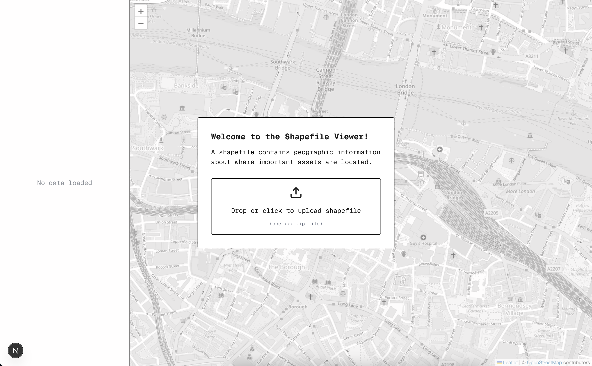

# Shapefile Viewer

## Overview
This is the beginnings of a web application that a user could use to render shapefiles. Right now,
it's purely client side - a user uploads a shapefile `*.zip`, the application parses it with
[shapefile.js](https://github.com/matthewdowns/shapefile.js), and it is rendered on top of a themed
[leaflet](http://leafletjs.com/) map.

## Development
If you'd like to run the application locally:
Prerequisites: ensure node.js and npm are installed (I built this with node `v22.3.0`)

1. Clone this github repository onto your system
2. Install dependencies with `npm install`
3. Run the application with `npm run dev`. If nothing is running on port 3000, the application will
   be available at http://localhost:3000. If something is running on that port, then next.js will
   select a different port - look at the dev server logs to see which one.

## Challenges
TBD

## Future Improvements
TBD
